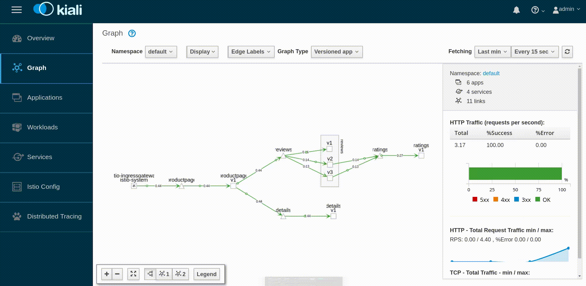
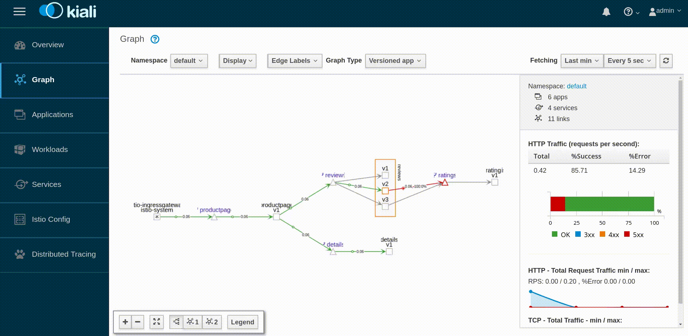
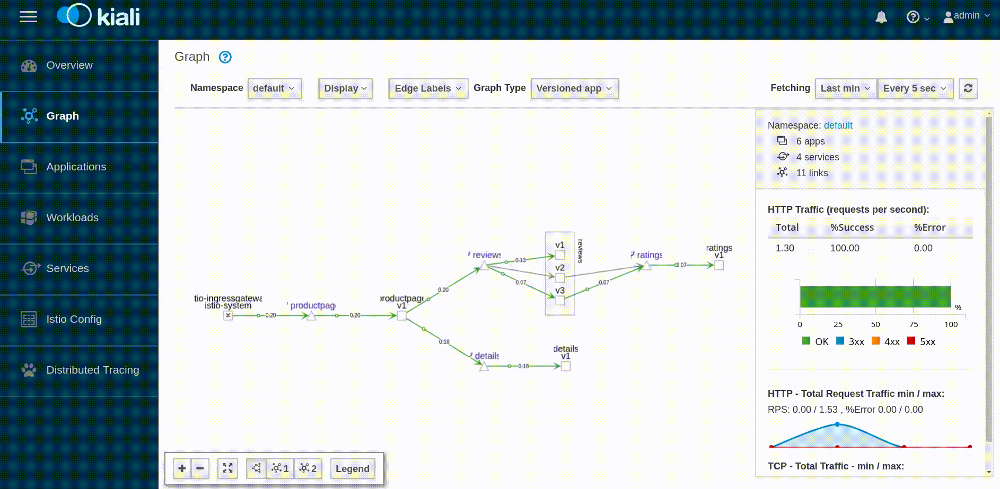
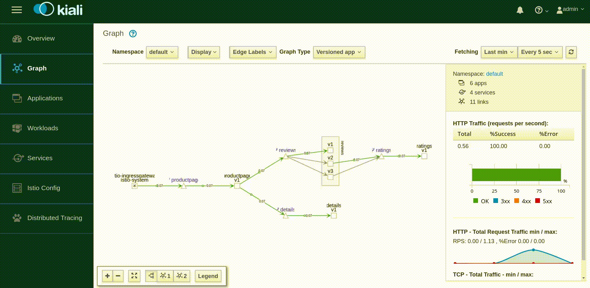

# Kubernetes with Istio demo

[](https://travis-ci.com/ruzickap/k8s-istio-demo)

[GitBook version](https://ruzickap.gitbook.io/k8s-istio-demo/)

Find below few commands showing basics of [Istio](https://istio.io/)...

## Requirements

* [kubectl](https://kubernetes.io/docs/tasks/tools/install-kubectl/) (kubernetes-client package)
* [Helm](https://helm.sh/)
* [Siege](https://github.com/JoeDog/siege) (siege package)
* [Terraform](https://www.terraform.io/)

or just

* [Docker](https://www.docker.com/)

## Install Kubernetes

The following sections will show you how to install k8s to [OpenStack](https://www.openstack.org/) or how to use [Minikube](https://kubernetes.io/docs/setup/minikube/).

### Install Kubernetes to OpenStack

Install k8s to Openstack using [Terraform](https://www.terraform.io/).

You will need to have [Docker](https://www.docker.com/) installed.

#### Prepare the working environment inside Docker

You can skip this part if you have [kubectl](https://kubernetes.io/docs/tasks/tools/install-kubectl/), [Helm](https://helm.sh/), [Siege](https://github.com/JoeDog/siege) and [Terraform](https://www.terraform.io/) installed.

Run Ubuntu docker image and mount the directory there:

```bash
docker run -it -rm -e DISPLAY=$DISPLAY -v /tmp/.X11-unix:/tmp/.X11-unix -v $PWD:/mnt ubuntu
```

Install necessary software into the Docker container:

```bash
apt update
apt install -y apt-transport-https curl firefox git gnupg jq openssh-client siege unzip vim
```

Install `kubernetes-client` package - `kubectl`:

```bash
curl -s https://packages.cloud.google.com/apt/doc/apt-key.gpg | apt-key add -
echo "deb https://apt.kubernetes.io/ kubernetes-xenial main" | tee -a /etc/apt/sources.list.d/kubernetes.list
apt-get update
apt-get install -y kubectl
```

Install [Terraform](https://www.terraform.io/):

```bash
TERRAFORM_LATEST_VERSION=$(curl -s https://checkpoint-api.hashicorp.com/v1/check/terraform | jq -r -M '.current_version')
curl --silent --location https://releases.hashicorp.com/terraform/${TERRAFORM_LATEST_VERSION}/terraform_${TERRAFORM_LATEST_VERSION}_linux_amd64.zip --output /tmp/terraform_linux_amd64.zip
unzip -o /tmp/terraform_linux_amd64.zip -d /usr/local/bin/
```

Change directory to `/mnt` where the git repository is mounted:

```bash
cd /mnt
```

#### Provision VMs in OpenStack

Start 3 VMs (one master and 2 workers) where the k8s will be installed.

Generate ssh keys if not exists:

```bash
test -f $HOME/.ssh/id_rsa || ( install -m 0700 -d $HOME/.ssh && ssh-keygen -b 2048 -t rsa -f $HOME/.ssh/id_rsa -q -N "" )
# ssh-agent must be running...
test -n "$SSH_AUTH_SOCK" || eval `ssh-agent`
ssh-add
```

Clone this git repository:

```bash
git clone https://github.com/ruzickap/k8s-istio-demo
cd k8s-istio-demo
```

Modify the Terraform variable file if needed:

```bash
cat > terrafrom/openstack/terraform.tfvars << EOF
openstack_auth_url                                 = "https://ic-us.ssl.mirantis.net:5000/v3"
openstack_instance_flavor_name                     = "compact.dbs"
openstack_instance_image_name                      = "bionic-server-cloudimg-amd64-20190119"
openstack_networking_subnet_dns_nameservers        = ["172.19.80.70"]
openstack_password                                 = "password"
openstack_tenant_name                              = "mirantis-services-team"
openstack_user_name                                = "pruzicka"
openstack_user_domain_name                         = "ldap_mirantis"
prefix                                             = "pruzicka-k8s-istio-demo"
EOF
```

Download Terraform components:

```bash
terraform init -var-file=terrafrom/openstack/terraform.tfvars terrafrom/openstack
```

Create VMs in OpenStack:

```bash
terraform apply -auto-approve -var-file=terrafrom/openstack/terraform.tfvars terrafrom/openstack
```

Show Terraform output:

```bash
terraform output
```

Output:

```shell
vms_name = [
    pruzicka-k8s-istio-demo-node01.01.localdomain,
    pruzicka-k8s-istio-demo-node02.01.localdomain,
    pruzicka-k8s-istio-demo-node03.01.localdomain
]
vms_public_ip = [
    172.16.240.185,
    172.16.242.218,
    172.16.240.44
]
```

At the end of the output you should see 3 IP addresses which should be accessible by ssh using your public key `~/.ssh/id_rsa.pub`.

#### Install k8s to the VMs

Install k8s using kubeadm to the provisioned VMs:

```bash
./install-k8s-kubeadm.sh
```

Check if all nodes are up:

```bash
export KUBECONFIG=$PWD/kubeconfig.conf
kubectl get nodes -o wide
```

Output:

```shell
NAME                             STATUS   ROLES    AGE   VERSION   INTERNAL-IP      EXTERNAL-IP   OS-IMAGE             KERNEL-VERSION      CONTAINER-RUNTIME
pruzicka-k8s-istio-demo-node01   Ready    master   2m    v1.13.3   192.168.250.11   <none>        Ubuntu 18.04.1 LTS   4.15.0-43-generic   docker://18.6.1
pruzicka-k8s-istio-demo-node02   Ready    <none>   45s   v1.13.3   192.168.250.12   <none>        Ubuntu 18.04.1 LTS   4.15.0-43-generic   docker://18.6.1
pruzicka-k8s-istio-demo-node03   Ready    <none>   50s   v1.13.3   192.168.250.13   <none>        Ubuntu 18.04.1 LTS   4.15.0-43-generic   docker://18.6.1
```

View services, deployments, and pods:

``` bash
kubectl get svc,deploy,po --all-namespaces -o wide
```

Output:

```shell
NAMESPACE     NAME                 TYPE        CLUSTER-IP   EXTERNAL-IP   PORT(S)         AGE     SELECTOR
default       service/kubernetes   ClusterIP   10.96.0.1    <none>        443/TCP         2m16s   <none>
kube-system   service/kube-dns     ClusterIP   10.96.0.10   <none>        53/UDP,53/TCP   2m11s   k8s-app=kube-dns

NAMESPACE     NAME                            READY   UP-TO-DATE   AVAILABLE   AGE     CONTAINERS   IMAGES                     SELECTOR
kube-system   deployment.extensions/coredns   2/2     2            2           2m11s   coredns      k8s.gcr.io/coredns:1.2.6   k8s-app=kube-dns

NAMESPACE     NAME                                                         READY   STATUS    RESTARTS   AGE    IP               NODE                             NOMINATED NODE   READINESS GATES
kube-system   pod/coredns-86c58d9df4-tlmvh                                 1/1     Running   0          116s   10.244.0.2       pruzicka-k8s-istio-demo-node01   <none>           <none>
kube-system   pod/coredns-86c58d9df4-zk685                                 1/1     Running   0          116s   10.244.0.3       pruzicka-k8s-istio-demo-node01   <none>           <none>
kube-system   pod/etcd-pruzicka-k8s-istio-demo-node01                      1/1     Running   0          79s    192.168.250.11   pruzicka-k8s-istio-demo-node01   <none>           <none>
kube-system   pod/kube-apiserver-pruzicka-k8s-istio-demo-node01            1/1     Running   0          72s    192.168.250.11   pruzicka-k8s-istio-demo-node01   <none>           <none>
kube-system   pod/kube-controller-manager-pruzicka-k8s-istio-demo-node01   1/1     Running   0          65s    192.168.250.11   pruzicka-k8s-istio-demo-node01   <none>           <none>
kube-system   pod/kube-flannel-ds-amd64-cvpfq                              1/1     Running   0          65s    192.168.250.13   pruzicka-k8s-istio-demo-node03   <none>           <none>
kube-system   pod/kube-flannel-ds-amd64-ggqmv                              1/1     Running   0          60s    192.168.250.12   pruzicka-k8s-istio-demo-node02   <none>           <none>
kube-system   pod/kube-flannel-ds-amd64-ql6g6                              1/1     Running   0          117s   192.168.250.11   pruzicka-k8s-istio-demo-node01   <none>           <none>
kube-system   pod/kube-proxy-79mx8                                         1/1     Running   0          117s   192.168.250.11   pruzicka-k8s-istio-demo-node01   <none>           <none>
kube-system   pod/kube-proxy-f99q2                                         1/1     Running   0          65s    192.168.250.13   pruzicka-k8s-istio-demo-node03   <none>           <none>
kube-system   pod/kube-proxy-w4tbd                                         1/1     Running   0          60s    192.168.250.12   pruzicka-k8s-istio-demo-node02   <none>           <none>
kube-system   pod/kube-scheduler-pruzicka-k8s-istio-demo-node01            1/1     Running   0          78s    192.168.250.11   pruzicka-k8s-istio-demo-node01   <none>           <none>
```

### Use Minikube to start the Kubernetes cluster

Install Minikube if needed: [https://kubernetes.io/docs/tasks/tools/install-minikube/](https://kubernetes.io/docs/tasks/tools/install-minikube/)

Start Minikube

```bash
KUBERNETES_VERSION=$(curl -s https://storage.googleapis.com/kubernetes-release/release/stable.txt | tr -d v)
sudo minikube start --vm-driver=none --bootstrapper=kubeadm --kubernetes-version=v${KUBERNETES_VERSION}
```

Install kubernetes-client package (kubectl):

```bash
curl -s https://packages.cloud.google.com/apt/doc/apt-key.gpg | apt-key add -
echo "deb https://apt.kubernetes.io/ kubernetes-xenial main" | tee -a /etc/apt/sources.list.d/kubernetes.list
apt-get update
apt-get install -y kubectl socat
```

## Install Helm

Install [Helm](https://helm.sh/) binary locally:

```bash
curl -s https://raw.githubusercontent.com/helm/helm/master/scripts/get | bash
```

Install Tiller (the Helm server-side component) into the Kubernetes cluster:

```bash
kubectl create serviceaccount tiller --namespace kube-system
kubectl create clusterrolebinding tiller-cluster-rule --clusterrole=cluster-admin --serviceaccount=kube-system:tiller
helm init --wait --service-account tiller
helm repo update
```

Check if the tiller was installed properly:

```bash
kubectl get pods -l app=helm --all-namespaces
```

Output:

```shell
NAMESPACE     NAME                            READY   STATUS    RESTARTS   AGE
kube-system   tiller-deploy-dbb85cb99-z4c47   1/1     Running   0          28s
```

## Instal Rook

Install [Rook](https://rook.io/) Operator ([Ceph](https://ceph.com/) storage for k8s):

```bash
helm repo add rook-stable https://charts.rook.io/stable
helm install --wait --name rook-ceph --namespace rook-ceph-system rook-stable/rook-ceph
sleep 10
```

See how the rook-ceph-system should look like:

```bash
kubectl get svc,deploy,po --namespace=rook-ceph-system -o wide
```

Output:

```shell
NAME                                       READY   UP-TO-DATE   AVAILABLE   AGE     CONTAINERS           IMAGES             SELECTOR
deployment.extensions/rook-ceph-operator   1/1     1            1           3m36s   rook-ceph-operator   rook/ceph:v0.9.2   app=rook-ceph-operator

NAME                                      READY   STATUS    RESTARTS   AGE     IP               NODE                             NOMINATED NODE   READINESS GATES
pod/rook-ceph-agent-2bxhq                 1/1     Running   0          2m14s   192.168.250.12   pruzicka-k8s-istio-demo-node02   <none>           <none>
pod/rook-ceph-agent-8h4p4                 1/1     Running   0          2m14s   192.168.250.11   pruzicka-k8s-istio-demo-node01   <none>           <none>
pod/rook-ceph-agent-mq69r                 1/1     Running   0          2m14s   192.168.250.13   pruzicka-k8s-istio-demo-node03   <none>           <none>
pod/rook-ceph-operator-7478c899b5-px2hc   1/1     Running   0          3m37s   10.244.2.3       pruzicka-k8s-istio-demo-node02   <none>           <none>
pod/rook-discover-8ffj8                   1/1     Running   0          2m14s   10.244.2.4       pruzicka-k8s-istio-demo-node02   <none>           <none>
pod/rook-discover-l56jj                   1/1     Running   0          2m14s   10.244.1.2       pruzicka-k8s-istio-demo-node03   <none>           <none>
pod/rook-discover-q9xwp                   1/1     Running   0          2m14s   10.244.0.4       pruzicka-k8s-istio-demo-node01   <none>           <none>
```

Create your Rook cluster:

```bash
kubectl create -f https://raw.githubusercontent.com/rook/rook/master/cluster/examples/kubernetes/ceph/cluster.yaml
sleep 50
```

Get the [Toolbox](https://rook.io/docs/rook/master/ceph-toolbox.html) with ceph commands:

```bash
kubectl create -f https://raw.githubusercontent.com/rook/rook/master/cluster/examples/kubernetes/ceph/toolbox.yaml
sleep 250
```

Check what was created in `rook-ceph` namespace:

```bash
kubectl get svc,deploy,po --namespace=rook-ceph -o wide
```

Output:

```shell
NAME                              TYPE        CLUSTER-IP      EXTERNAL-IP   PORT(S)    AGE     SELECTOR
service/rook-ceph-mgr             ClusterIP   10.103.36.128   <none>        9283/TCP   8m45s   app=rook-ceph-mgr,rook_cluster=rook-ceph
service/rook-ceph-mgr-dashboard   ClusterIP   10.99.173.58    <none>        8443/TCP   8m45s   app=rook-ceph-mgr,rook_cluster=rook-ceph
service/rook-ceph-mon-a           ClusterIP   10.102.39.160   <none>        6790/TCP   12m     app=rook-ceph-mon,ceph_daemon_id=a,mon=a,mon_cluster=rook-ceph,rook_cluster=rook-ceph
service/rook-ceph-mon-b           ClusterIP   10.102.49.137   <none>        6790/TCP   11m     app=rook-ceph-mon,ceph_daemon_id=b,mon=b,mon_cluster=rook-ceph,rook_cluster=rook-ceph
service/rook-ceph-mon-c           ClusterIP   10.96.25.143    <none>        6790/TCP   10m     app=rook-ceph-mon,ceph_daemon_id=c,mon=c,mon_cluster=rook-ceph,rook_cluster=rook-ceph

NAME                                    READY   UP-TO-DATE   AVAILABLE   AGE     CONTAINERS        IMAGES             SELECTOR
deployment.extensions/rook-ceph-mgr-a   1/1     1            1           9m33s   mgr               ceph/ceph:v13      app=rook-ceph-mgr,ceph_daemon_id=a,instance=a,mgr=a,rook_cluster=rook-ceph
deployment.extensions/rook-ceph-mon-a   1/1     1            1           12m     mon               ceph/ceph:v13      app=rook-ceph-mon,ceph_daemon_id=a,mon=a,mon_cluster=rook-ceph,rook_cluster=rook-ceph
deployment.extensions/rook-ceph-mon-b   1/1     1            1           11m     mon               ceph/ceph:v13      app=rook-ceph-mon,ceph_daemon_id=b,mon=b,mon_cluster=rook-ceph,rook_cluster=rook-ceph
deployment.extensions/rook-ceph-mon-c   1/1     1            1           10m     mon               ceph/ceph:v13      app=rook-ceph-mon,ceph_daemon_id=c,mon=c,mon_cluster=rook-ceph,rook_cluster=rook-ceph
deployment.extensions/rook-ceph-osd-0   1/1     1            1           8m34s   osd               ceph/ceph:v13      app=rook-ceph-osd,ceph-osd-id=0,rook_cluster=rook-ceph
deployment.extensions/rook-ceph-osd-1   1/1     1            1           8m33s   osd               ceph/ceph:v13      app=rook-ceph-osd,ceph-osd-id=1,rook_cluster=rook-ceph
deployment.extensions/rook-ceph-osd-2   1/1     1            1           8m33s   osd               ceph/ceph:v13      app=rook-ceph-osd,ceph-osd-id=2,rook_cluster=rook-ceph
deployment.extensions/rook-ceph-tools   1/1     1            1           12m     rook-ceph-tools   rook/ceph:master   app=rook-ceph-tools

NAME                                                             READY   STATUS      RESTARTS   AGE     IP               NODE                             NOMINATED NODE   READINESS GATES
pod/rook-ceph-mgr-a-669f5b47fc-sjvrr                             1/1     Running     0          9m33s   10.244.1.6       pruzicka-k8s-istio-demo-node03   <none>           <none>
pod/rook-ceph-mon-a-784f8fb5b6-zcvjr                             1/1     Running     0          12m     10.244.0.5       pruzicka-k8s-istio-demo-node01   <none>           <none>
pod/rook-ceph-mon-b-6dfbf486f4-2ktpm                             1/1     Running     0          11m     10.244.2.5       pruzicka-k8s-istio-demo-node02   <none>           <none>
pod/rook-ceph-mon-c-6c85f6f44-j5wwv                              1/1     Running     0          10m     10.244.1.5       pruzicka-k8s-istio-demo-node03   <none>           <none>
pod/rook-ceph-osd-0-6dd9cdc946-7th52                             1/1     Running     0          8m34s   10.244.1.8       pruzicka-k8s-istio-demo-node03   <none>           <none>
pod/rook-ceph-osd-1-64cdd77897-9vdrh                             1/1     Running     0          8m33s   10.244.2.7       pruzicka-k8s-istio-demo-node02   <none>           <none>
pod/rook-ceph-osd-2-67fcc446bd-skq52                             1/1     Running     0          8m33s   10.244.0.7       pruzicka-k8s-istio-demo-node01   <none>           <none>
pod/rook-ceph-osd-prepare-pruzicka-k8s-istio-demo-node01-z29hj   0/2     Completed   0          8m39s   10.244.0.6       pruzicka-k8s-istio-demo-node01   <none>           <none>
pod/rook-ceph-osd-prepare-pruzicka-k8s-istio-demo-node02-q8xqx   0/2     Completed   0          8m39s   10.244.2.6       pruzicka-k8s-istio-demo-node02   <none>           <none>
pod/rook-ceph-osd-prepare-pruzicka-k8s-istio-demo-node03-vbwxv   0/2     Completed   0          8m39s   10.244.1.7       pruzicka-k8s-istio-demo-node03   <none>           <none>
pod/rook-ceph-tools-76c7d559b6-s6s4l                             1/1     Running     0          12m     192.168.250.12   pruzicka-k8s-istio-demo-node02   <none>           <none>
```

Create a storage class based on the Ceph RBD volume plugin:

```bash
kubectl create -f https://raw.githubusercontent.com/rook/rook/master/cluster/examples/kubernetes/ceph/storageclass.yaml
# Give Ceph some time to create pool...
sleep 10
```

Set `rook-ceph-block` as default Storage Class:

```bash
kubectl patch storageclass rook-ceph-block -p '{"metadata": {"annotations":{"storageclass.kubernetes.io/is-default-class":"true"}}}'
```

Check the Storage Classes:

```bash
kubectl describe storageclass
```

Output:

```shell
Name:                  rook-ceph-block
IsDefaultClass:        Yes
Annotations:           storageclass.kubernetes.io/is-default-class=true
Provisioner:           ceph.rook.io/block
Parameters:            blockPool=replicapool,clusterNamespace=rook-ceph,fstype=xfs
AllowVolumeExpansion:  <unset>
MountOptions:          <none>
ReclaimPolicy:         Delete
VolumeBindingMode:     Immediate
Events:                <none>
```

See the CephBlockPool:

```bash
kubectl describe cephblockpool --namespace=rook-ceph
```

Output:

```shell
Name:         replicapool
Namespace:    rook-ceph
Labels:       <none>
Annotations:  <none>
API Version:  ceph.rook.io/v1
Kind:         CephBlockPool
Metadata:
  Creation Timestamp:  2019-02-04T09:51:55Z
  Generation:          1
  Resource Version:    3171
  Self Link:           /apis/ceph.rook.io/v1/namespaces/rook-ceph/cephblockpools/replicapool
  UID:                 8163367d-2862-11e9-a470-fa163e90237a
Spec:
  Replicated:
    Size:  1
Events:    <none>
```

Check the status of your Ceph installation:

```bash
kubectl -n rook-ceph exec $(kubectl -n rook-ceph get pod -l "app=rook-ceph-tools" -o jsonpath='{.items[0].metadata.name}') -- ceph status
```

Output:

```shell
  cluster:
    id:     1f4458a6-f574-4e6c-8a25-5a5eef6eb0a7
    health: HEALTH_OK

  services:
    mon: 3 daemons, quorum c,a,b
    mgr: a(active)
    osd: 3 osds: 3 up, 3 in

  data:
    pools:   1 pools, 100 pgs
    objects: 0  objects, 0 B
    usage:   13 GiB used, 44 GiB / 58 GiB avail
    pgs:     100 active+clean
```

Ceph status:

```bash
kubectl -n rook-ceph exec $(kubectl -n rook-ceph get pod -l "app=rook-ceph-tools" -o jsonpath='{.items[0].metadata.name}') -- ceph osd status
```

Output:

```shell
+----+--------------------------------+-------+-------+--------+---------+--------+---------+-----------+
| id |              host              |  used | avail | wr ops | wr data | rd ops | rd data |   state   |
+----+--------------------------------+-------+-------+--------+---------+--------+---------+-----------+
| 0  | pruzicka-k8s-istio-demo-node03 | 4302M | 15.0G |    0   |     0   |    0   |     0   | exists,up |
| 1  | pruzicka-k8s-istio-demo-node02 | 4455M | 14.8G |    0   |     0   |    0   |     0   | exists,up |
| 2  | pruzicka-k8s-istio-demo-node01 | 4948M | 14.3G |    0   |     0   |    0   |     0   | exists,up |
+----+--------------------------------+-------+-------+--------+---------+--------+---------+-----------+
```

Check health of Ceph cluster:

```bash
kubectl -n rook-ceph exec $(kubectl -n rook-ceph get pod -l "app=rook-ceph-tools" -o jsonpath='{.items[0].metadata.name}') -- ceph health detail
```

Output:

```shell
HEALTH_OK
```

Check monitor quorum status of Ceph:

```bash
kubectl -n rook-ceph exec $(kubectl -n rook-ceph get pod -l "app=rook-ceph-tools" -o jsonpath='{.items[0].metadata.name}') -- ceph quorum_status --format json-pretty
```

Dump monitoring information from Ceph:

```bash
kubectl -n rook-ceph exec $(kubectl -n rook-ceph get pod -l "app=rook-ceph-tools" -o jsonpath='{.items[0].metadata.name}') -- ceph mon dump
```

Output:

```shell
dumped monmap epoch 3
epoch 3
fsid 1f4458a6-f574-4e6c-8a25-5a5eef6eb0a7
last_changed 2019-02-04 09:41:39.772112
created 2019-02-04 09:40:08.865074
0: 10.96.25.143:6790/0 mon.c
1: 10.102.39.160:6790/0 mon.a
2: 10.102.49.137:6790/0 mon.b
```

Check the cluster usage status:

```bash
kubectl -n rook-ceph exec $(kubectl -n rook-ceph get pod -l "app=rook-ceph-tools" -o jsonpath='{.items[0].metadata.name}') -- ceph df
```

Output:

```shell
GLOBAL:
    SIZE       AVAIL      RAW USED     %RAW USED
    58 GiB     44 GiB       13 GiB         23.22
POOLS:
    NAME            ID     USED     %USED     MAX AVAIL     OBJECTS
    replicapool     1       0 B         0        40 GiB           0
```

Check OSD usage of Ceph:

```bash
kubectl -n rook-ceph exec $(kubectl -n rook-ceph get pod -l "app=rook-ceph-tools" -o jsonpath='{.items[0].metadata.name}') -- ceph osd df
```

Output:

```shell
ID CLASS WEIGHT  REWEIGHT SIZE   USE     AVAIL  %USE  VAR  PGS
 2   hdd 0.01880  1.00000 19 GiB 4.8 GiB 14 GiB 25.15 1.08  36
 1   hdd 0.01880  1.00000 19 GiB 4.4 GiB 15 GiB 22.65 0.98  32
 0   hdd 0.01880  1.00000 19 GiB 4.2 GiB 15 GiB 21.87 0.94  32
                    TOTAL 58 GiB  13 GiB 44 GiB 23.22
MIN/MAX VAR: 0.94/1.08  STDDEV: 1.40
```

Check the Ceph monitor:

```bash
kubectl -n rook-ceph exec $(kubectl -n rook-ceph get pod -l "app=rook-ceph-tools" -o jsonpath='{.items[0].metadata.name}') -- ceph mon stat
```

Output:

```shell
e3: 3 mons at {a=10.102.39.160:6790/0,b=10.102.49.137:6790/0,c=10.96.25.143:6790/0}, election epoch 14, leader 0 c, quorum 0,1,2 c,a,b
```

Check OSD stats:

```bash
kubectl -n rook-ceph exec $(kubectl -n rook-ceph get pod -l "app=rook-ceph-tools" -o jsonpath='{.items[0].metadata.name}') -- ceph osd stat
```

Output:

```shell
3 osds: 3 up, 3 in; epoch: e20
```

Check pool stats:

```bash
kubectl -n rook-ceph exec $(kubectl -n rook-ceph get pod -l "app=rook-ceph-tools" -o jsonpath='{.items[0].metadata.name}') -- ceph osd pool stats
```

Output:

```shell
pool replicapool id 1
  nothing is going on
```

Check pg stats:

```bash
kubectl -n rook-ceph exec $(kubectl -n rook-ceph get pod -l "app=rook-ceph-tools" -o jsonpath='{.items[0].metadata.name}') -- ceph pg stat
```

Output:

```shell
100 pgs: 100 active+clean; 0 B data, 13 GiB used, 44 GiB / 58 GiB avail
```

List the Ceph pools in detail:

```bash
kubectl -n rook-ceph exec $(kubectl -n rook-ceph get pod -l "app=rook-ceph-tools" -o jsonpath='{.items[0].metadata.name}') -- ceph osd pool ls detail
```

Output:

```shell
pool 1 'replicapool' replicated size 1 min_size 1 crush_rule 1 object_hash rjenkins pg_num 100 pgp_num 100 last_change 20 flags hashpspool stripe_width 0 application rbd
```

Check the CRUSH map view of OSDs:

```bash
kubectl -n rook-ceph exec $(kubectl -n rook-ceph get pod -l "app=rook-ceph-tools" -o jsonpath='{.items[0].metadata.name}') -- ceph osd tree
```

Output:

```shell
ID CLASS WEIGHT  TYPE NAME                               STATUS REWEIGHT PRI-AFF
-1       0.05640 root default
-4       0.01880     host pruzicka-k8s-istio-demo-node01
 2   hdd 0.01880         osd.2                               up  1.00000 1.00000
-3       0.01880     host pruzicka-k8s-istio-demo-node02
 1   hdd 0.01880         osd.1                               up  1.00000 1.00000
-2       0.01880     host pruzicka-k8s-istio-demo-node03
 0   hdd 0.01880         osd.0                               up  1.00000 1.00000
```

List the cluster authentication keys:

```bash
kubectl -n rook-ceph exec $(kubectl -n rook-ceph get pod -l "app=rook-ceph-tools" -o jsonpath='{.items[0].metadata.name}') -- ceph auth list
```

## Install ElasticSearch, Kibana, Fluentbit

Add [ElasticSearch operator](https://github.com/upmc-enterprises/elasticsearch-operator) to Helm:

```bash
helm repo add es-operator https://raw.githubusercontent.com/upmc-enterprises/elasticsearch-operator/master/charts/
```

Install ElasticSearch operator:

```bash
helm install --wait --name elasticsearch-operator es-operator/elasticsearch-operator --set rbac.enabled=True --namespace es-operator
sleep 50
```

Check how the operator looks like:

```bash
kubectl get svc,deploy,po --namespace=es-operator -o wide
```

Output:

```shell
NAME                                           READY   UP-TO-DATE   AVAILABLE   AGE    CONTAINERS               IMAGES                                          SELECTOR
deployment.extensions/elasticsearch-operator   1/1     1            1           106s   elasticsearch-operator   upmcenterprises/elasticsearch-operator:0.0.12   name=elasticsearch-operator,release=elasticsearch-operator

NAME                                          READY   STATUS    RESTARTS   AGE    IP           NODE                             NOMINATED NODE   READINESS GATES
pod/elasticsearch-operator-5dc59b8cc5-6946l   1/1     Running   0          106s   10.244.1.9   pruzicka-k8s-istio-demo-node03   <none>           <none>
```

Install ElasticSearch cluster:

```bash
helm install --wait --name=elasticsearch --namespace logging es-operator/elasticsearch \
  --set kibana.enabled=true \
  --set cerebro.enabled=true \
  --set storage.class=rook-ceph-block \
  --set clientReplicas=1,masterReplicas=1,dataReplicas=1
sleep 500
```

Show ElasticSearch components:

```bash
kubectl get svc,deploy,po,pvc,elasticsearchclusters --namespace=logging -o wide
```

Output:

```shell
NAME                                                    TYPE        CLUSTER-IP       EXTERNAL-IP   PORT(S)    AGE   SELECTOR
service/cerebro-elasticsearch-cluster                   ClusterIP   10.105.197.151   <none>        80/TCP     18m   role=cerebro
service/elasticsearch-discovery-elasticsearch-cluster   ClusterIP   10.111.76.241    <none>        9300/TCP   18m   component=elasticsearch-elasticsearch-cluster,role=master
service/elasticsearch-elasticsearch-cluster             ClusterIP   10.104.103.49    <none>        9200/TCP   18m   component=elasticsearch-elasticsearch-cluster,role=client
service/es-data-svc-elasticsearch-cluster               ClusterIP   10.98.179.244    <none>        9300/TCP   18m   component=elasticsearch-elasticsearch-cluster,role=data
service/kibana-elasticsearch-cluster                    ClusterIP   10.110.19.242    <none>        80/TCP     18m   role=kibana

NAME                                                    READY   UP-TO-DATE   AVAILABLE   AGE   CONTAINERS                        IMAGES                                                    SELECTOR
deployment.extensions/cerebro-elasticsearch-cluster     1/1     1            1           18m   cerebro-elasticsearch-cluster     upmcenterprises/cerebro:0.6.8                             component=elasticsearch-elasticsearch-cluster,name=cerebro-elasticsearch-cluster,role=cerebro
deployment.extensions/es-client-elasticsearch-cluster   1/1     1            1           18m   es-client-elasticsearch-cluster   upmcenterprises/docker-elasticsearch-kubernetes:6.1.3_0   cluster=elasticsearch-cluster,component=elasticsearch-elasticsearch-cluster,name=es-client-elasticsearch-cluster,role=client
deployment.extensions/kibana-elasticsearch-cluster      1/1     1            1           18m   kibana-elasticsearch-cluster      docker.elastic.co/kibana/kibana-oss:6.1.3                 component=elasticsearch-elasticsearch-cluster,name=kibana-elasticsearch-cluster,role=kibana

NAME                                                    READY   STATUS    RESTARTS   AGE   IP            NODE                             NOMINATED NODE   READINESS GATES
pod/cerebro-elasticsearch-cluster-64888cf977-dgb8g      1/1     Running   0          18m   10.244.0.9    pruzicka-k8s-istio-demo-node01   <none>           <none>
pod/es-client-elasticsearch-cluster-8d9df64b7-tvl8z     1/1     Running   0          18m   10.244.1.11   pruzicka-k8s-istio-demo-node03   <none>           <none>
pod/es-data-elasticsearch-cluster-rook-ceph-block-0     1/1     Running   0          18m   10.244.2.11   pruzicka-k8s-istio-demo-node02   <none>           <none>
pod/es-master-elasticsearch-cluster-rook-ceph-block-0   1/1     Running   0          18m   10.244.2.10   pruzicka-k8s-istio-demo-node02   <none>           <none>
pod/kibana-elasticsearch-cluster-7fb7f88f55-6sl6j       1/1     Running   0          18m   10.244.2.9    pruzicka-k8s-istio-demo-node02   <none>           <none>

NAME                                                                              STATUS   VOLUME                                     CAPACITY   ACCESS MODES   STORAGECLASS      AGE
persistentvolumeclaim/es-data-es-data-elasticsearch-cluster-rook-ceph-block-0     Bound    pvc-870ad81a-2863-11e9-a470-fa163e90237a   1Gi        RWO            rook-ceph-block   18m
persistentvolumeclaim/es-data-es-master-elasticsearch-cluster-rook-ceph-block-0   Bound    pvc-86fcb9ce-2863-11e9-a470-fa163e90237a   1Gi        RWO            rook-ceph-block   18m

NAME                                                              AGE
elasticsearchcluster.enterprises.upmc.com/elasticsearch-cluster   18m
```

Install [Fluentbit](https://fluentbit.io/):

```bash
helm install --wait stable/fluent-bit --name=fluent-bit --namespace=logging \
  --set metrics.enabled=true \
  --set backend.type=es \
  --set backend.es.host=elasticsearch-elasticsearch-cluster \
  --set backend.es.tls=on \
  --set backend.es.tls_verify=off
```

Configure port forwarding for Kibana:

```bash
# Kibana UI - https://localhost:5601
kubectl -n logging port-forward $(kubectl -n logging get pod -l role=kibana -o jsonpath='{.items[0].metadata.name}') 5601:5601 &
```

Configure ElasticSearch:

* Navigate to the [Kibana UI](https://localhost:5601) and click the "Set up index patterns" in the top right.
* Use * as the index pattern, and click "Next step.".
* Select @timestamp as the Time Filter field name, and click "Create index pattern."

Check fluent-bit installation:

```bash
kubectl get -l app=fluent-bit svc,pods --all-namespaces -o wide
```

Output:

```shell
NAMESPACE   NAME                                    TYPE        CLUSTER-IP     EXTERNAL-IP   PORT(S)    AGE   SELECTOR
logging     service/fluent-bit-fluent-bit-metrics   ClusterIP   10.97.33.162   <none>        2020/TCP   80s   app=fluent-bit,release=fluent-bit

NAMESPACE   NAME                              READY   STATUS    RESTARTS   AGE   IP            NODE                             NOMINATED NODE   READINESS GATES
logging     pod/fluent-bit-fluent-bit-426ph   1/1     Running   0          80s   10.244.0.10   pruzicka-k8s-istio-demo-node01   <none>           <none>
logging     pod/fluent-bit-fluent-bit-c6tbx   1/1     Running   0          80s   10.244.1.12   pruzicka-k8s-istio-demo-node03   <none>           <none>
logging     pod/fluent-bit-fluent-bit-zfkqr   1/1     Running   0          80s   10.244.2.12   pruzicka-k8s-istio-demo-node02   <none>           <none>
```

## Istio Architecture

Few notes about Istio architecture...


* [Envoy](https://istio.io/docs/concepts/what-is-istio/#envoy) - is a high-performance proxy to mediate all inbound and outbound traffic for all services in the service mesh.
* [Mixer](https://istio.io/docs/concepts/what-is-istio/#mixer) - enforces access control and usage policies across the service mesh, and collects telemetry data from the Envoy proxy and other services.
* [Pilot](https://istio.io/docs/concepts/what-is-istio/#pilot) - provides service discovery for the Envoy sidecars, traffic management capabilities for intelligent routing.
* [Citadel](https://istio.io/docs/concepts/what-is-istio/#citadel) - provides strong service-to-service and end-user authentication with built-in identity and credential management.


### Istio types

* [VirtualService](https://istio.io/docs/reference/config/istio.networking.v1alpha3/#VirtualService) defines the rules that control how requests for a service are routed within an Istio service mesh.
* [DestinationRule](https://istio.io/docs/reference/config/istio.networking.v1alpha3/#DestinationRule) configures the set of policies to be applied to a request after VirtualService routing has occurred.
* [ServiceEntry](https://istio.io/docs/reference/config/istio.networking.v1alpha3/#ServiceEntry) is commonly used to enable requests to services outside of an Istio service mesh.
* [Gateway](https://istio.io/docs/reference/config/istio.networking.v1alpha3/#Gateway) configures a load balancer for HTTP/TCP traffic, most commonly operating at the edge of the mesh to enable ingress traffic for an application.

## Install Istio

Either download Istio directly from [https://github.com/istio/istio/releases](https://github.com/istio/istio/releases) or get the latest version by using curl:

```bash
test -d files || mkdir files
cd files
curl -sL https://git.io/getLatestIstio | sh -
```

Change the directory to the Istio installation files location:

```bash
cd istio*
```

Install [Istio](https://istio.io/) using Helm:

```bash
helm install --wait --name istio --namespace istio-system install/kubernetes/helm/istio \
  --set gateways.istio-ingressgateway.type=NodePort \
  --set gateways.istio-egressgateway.type=NodePort \
  --set grafana.enabled=true \
  --set kiali.enabled=true \
  --set kiali.dashboard.grafanaURL=http://localhost:3000 \
  --set kiali.dashboard.jaegerURL=http://localhost:16686 \
  --set servicegraph.enabled=true \
  --set telemetry-gateway.grafanaEnabled=true \
  --set telemetry-gateway.prometheusEnabled=true \
  --set tracing.enabled=true
```

See the Istio components:

```bash
kubectl get --namespace=istio-system svc,deployment,pods -o wide
```

Output:

```shell
NAME                             TYPE        CLUSTER-IP       EXTERNAL-IP   PORT(S)                                                                                                                   AGE   SELECTOR
service/grafana                  ClusterIP   10.101.117.126   <none>        3000/TCP                                                                                                                  15m   app=grafana
service/istio-citadel            ClusterIP   10.99.235.151    <none>        8060/TCP,9093/TCP                                                                                                         15m   istio=citadel
service/istio-egressgateway      NodePort    10.105.213.174   <none>        80:31610/TCP,443:31811/TCP                                                                                                15m   app=istio-egressgateway,istio=egressgateway
service/istio-galley             ClusterIP   10.110.154.0     <none>        443/TCP,9093/TCP                                                                                                          15m   istio=galley
service/istio-ingressgateway     NodePort    10.101.212.170   <none>        80:31380/TCP,443:31390/TCP,31400:31400/TCP,15011:31814/TCP,8060:31435/TCP,853:31471/TCP,15030:30210/TCP,15031:30498/TCP   15m   app=istio-ingressgateway,istio=ingressgateway
service/istio-pilot              ClusterIP   10.96.34.157     <none>        15010/TCP,15011/TCP,8080/TCP,9093/TCP                                                                                     15m   istio=pilot
service/istio-policy             ClusterIP   10.98.185.215    <none>        9091/TCP,15004/TCP,9093/TCP                                                                                               15m   istio-mixer-type=policy,istio=mixer
service/istio-sidecar-injector   ClusterIP   10.97.47.179     <none>        443/TCP                                                                                                                   15m   istio=sidecar-injector
service/istio-telemetry          ClusterIP   10.103.23.55     <none>        9091/TCP,15004/TCP,9093/TCP,42422/TCP                                                                                     15m   istio-mixer-type=telemetry,istio=mixer
service/jaeger-agent             ClusterIP   None             <none>        5775/UDP,6831/UDP,6832/UDP                                                                                                15m   app=jaeger
service/jaeger-collector         ClusterIP   10.110.10.174    <none>        14267/TCP,14268/TCP                                                                                                       15m   app=jaeger
service/jaeger-query             ClusterIP   10.98.172.235    <none>        16686/TCP                                                                                                                 15m   app=jaeger
service/kiali                    ClusterIP   10.111.114.225   <none>        20001/TCP                                                                                                                 15m   app=kiali
service/prometheus               ClusterIP   10.111.132.151   <none>        9090/TCP                                                                                                                  15m   app=prometheus
service/servicegraph             ClusterIP   10.109.59.250    <none>        8088/TCP                                                                                                                  15m   app=servicegraph
service/tracing                  ClusterIP   10.96.59.251     <none>        80/TCP                                                                                                                    15m   app=jaeger
service/zipkin                   ClusterIP   10.107.168.128   <none>        9411/TCP                                                                                                                  15m   app=jaeger

NAME                                           READY   UP-TO-DATE   AVAILABLE   AGE   CONTAINERS                 IMAGES                                                      SELECTOR
deployment.extensions/grafana                  1/1     1            1           15m   grafana                    grafana/grafana:5.2.3                                       app=grafana
deployment.extensions/istio-citadel            1/1     1            1           15m   citadel                    docker.io/istio/citadel:1.0.5                               istio=citadel
deployment.extensions/istio-egressgateway      1/1     1            1           15m   istio-proxy                docker.io/istio/proxyv2:1.0.5                               app=istio-egressgateway,istio=egressgateway
deployment.extensions/istio-galley             1/1     1            1           15m   validator                  docker.io/istio/galley:1.0.5                                istio=galley
deployment.extensions/istio-ingressgateway     1/1     1            1           15m   istio-proxy                docker.io/istio/proxyv2:1.0.5                               app=istio-ingressgateway,istio=ingressgateway
deployment.extensions/istio-pilot              1/1     1            1           15m   discovery,istio-proxy      docker.io/istio/pilot:1.0.5,docker.io/istio/proxyv2:1.0.5   app=pilot,istio=pilot
deployment.extensions/istio-policy             1/1     1            1           15m   mixer,istio-proxy          docker.io/istio/mixer:1.0.5,docker.io/istio/proxyv2:1.0.5   app=policy,istio=mixer,istio-mixer-type=policy
deployment.extensions/istio-sidecar-injector   1/1     1            1           15m   sidecar-injector-webhook   docker.io/istio/sidecar_injector:1.0.5                      istio=sidecar-injector
deployment.extensions/istio-telemetry          1/1     1            1           15m   mixer,istio-proxy          docker.io/istio/mixer:1.0.5,docker.io/istio/proxyv2:1.0.5   app=telemetry,istio=mixer,istio-mixer-type=telemetry
deployment.extensions/istio-tracing            1/1     1            1           15m   jaeger                     docker.io/jaegertracing/all-in-one:1.5                      app=jaeger
deployment.extensions/kiali                    1/1     1            1           15m   kiali                      docker.io/kiali/kiali:v0.10                                 app=kiali
deployment.extensions/prometheus               1/1     1            1           15m   prometheus                 docker.io/prom/prometheus:v2.3.1                            app=prometheus
deployment.extensions/servicegraph             1/1     1            1           15m   servicegraph               docker.io/istio/servicegraph:1.0.5                          app=servicegraph

NAME                                          READY   STATUS      RESTARTS   AGE   IP            NODE                             NOMINATED NODE   READINESS GATES
pod/grafana-59b8896965-pmwd2                  1/1     Running     0          15m   10.244.1.16   pruzicka-k8s-istio-demo-node03   <none>           <none>
pod/istio-citadel-856f994c58-8r8nr            1/1     Running     0          15m   10.244.1.17   pruzicka-k8s-istio-demo-node03   <none>           <none>
pod/istio-egressgateway-5649fcf57-sv8wf       1/1     Running     0          15m   10.244.1.14   pruzicka-k8s-istio-demo-node03   <none>           <none>
pod/istio-galley-7665f65c9c-8sjmm             1/1     Running     0          15m   10.244.1.18   pruzicka-k8s-istio-demo-node03   <none>           <none>
pod/istio-grafana-post-install-kw74d          0/1     Completed   0          10m   10.244.1.19   pruzicka-k8s-istio-demo-node03   <none>           <none>
pod/istio-ingressgateway-6755b9bbf6-f7pnx     1/1     Running     0          15m   10.244.1.13   pruzicka-k8s-istio-demo-node03   <none>           <none>
pod/istio-pilot-56855d999b-6zq86              2/2     Running     0          15m   10.244.0.11   pruzicka-k8s-istio-demo-node01   <none>           <none>
pod/istio-policy-6fcb6d655f-4zndw             2/2     Running     0          15m   10.244.2.13   pruzicka-k8s-istio-demo-node02   <none>           <none>
pod/istio-sidecar-injector-768c79f7bf-74wbc   1/1     Running     0          15m   10.244.2.18   pruzicka-k8s-istio-demo-node02   <none>           <none>
pod/istio-telemetry-664d896cf5-smz7w          2/2     Running     0          15m   10.244.2.14   pruzicka-k8s-istio-demo-node02   <none>           <none>
pod/istio-tracing-6b994895fd-vb58q            1/1     Running     0          15m   10.244.2.17   pruzicka-k8s-istio-demo-node02   <none>           <none>
pod/kiali-67c69889b5-sw92h                    1/1     Running     0          15m   10.244.1.15   pruzicka-k8s-istio-demo-node03   <none>           <none>
pod/prometheus-76b7745b64-kwzj5               1/1     Running     0          15m   10.244.2.15   pruzicka-k8s-istio-demo-node02   <none>           <none>
pod/servicegraph-5c4485945b-j9bp2             1/1     Running     0          15m   10.244.2.16   pruzicka-k8s-istio-demo-node02   <none>           <none>
```

Configure Istio with a new log type and send those logs to the FluentD:

```bash
kubectl apply -f ../../yaml/fluentd-istio.yaml
```

## Istio example

Check how Istio can be used and how it works...

### Check + Enable Istio in default namespace

Let the default namespace to use Istio injection:

```bash
kubectl label namespace default istio-injection=enabled
```

Check namespaces:

```bash
kubectl get namespace -L istio-injection
```

Output:

```shell
NAME               STATUS   AGE   ISTIO-INJECTION
default            Active   70m   enabled
es-operator        Active   41m
istio-system       Active   16m
kube-public        Active   70m
kube-system        Active   70m
logging            Active   38m
rook-ceph          Active   59m
rook-ceph-system   Active   63m
```

Configure port forwarding for Istio services:

```bash
# Jaeger - http://localhost:16686
kubectl port-forward -n istio-system $(kubectl get pod -n istio-system -l app=jaeger -o jsonpath='{.items[0].metadata.name}') 16686:16686 &

# Prometheus UI - http://localhost:9090/graph
kubectl -n istio-system port-forward $(kubectl -n istio-system get pod -l app=prometheus -o jsonpath='{.items[0].metadata.name}') 9090:9090 &

# Grafana - http://localhost:3000/dashboard/db/istio-mesh-dashboard
kubectl -n istio-system port-forward $(kubectl -n istio-system get pod -l app=grafana -o jsonpath='{.items[0].metadata.name}') 3000:3000 &

# Kiali UI - http://localhost:20001
kubectl -n istio-system port-forward $(kubectl -n istio-system get pod -l app=kiali -o jsonpath='{.items[0].metadata.name}') 20001:20001 &

# Servicegraph UI - http://localhost:8088/force/forcegraph.html
kubectl -n istio-system port-forward $(kubectl -n istio-system get pod -l app=servicegraph -o jsonpath='{.items[0].metadata.name}') 8088:8088 &
```

### Deploy application into the default namespace where Istio is enabled

The Bookinfo application is broken into four separate microservices:

* `productpage` - the productpage microservice calls the details and reviews microservices to populate the page.
* `details` - the details microservice contains book information.
* `reviews` - the reviews microservice contains book reviews. It also calls the ratings microservice.
* `ratings` - the ratings microservice contains book ranking information that accompanies a book review.

There are 3 versions of the `reviews` microservice:

* Version `v1` - doesn’t call the **ratings service**.
* Version `v2` - calls the ratings service, and displays each rating as 1 to 5 **black stars**.
* Version `v3` - calls the ratings service, and displays each rating as 1 to 5 **red stars**.

[Bookinfo](https://istio.io/docs/examples/bookinfo/) application architecture


Deploy the demo of [Bookinfo](https://istio.io/docs/examples/bookinfo/) application:

```bash
kubectl apply -f samples/bookinfo/platform/kube/bookinfo.yaml
sleep 300
```

Confirm all services and pods are correctly defined and running:

```bash
kubectl get svc,deployment,pods -o wide
```

Output:

```shell
NAME                  TYPE        CLUSTER-IP       EXTERNAL-IP   PORT(S)    AGE     SELECTOR
service/details       ClusterIP   10.103.142.153   <none>        9080/TCP   4m21s   app=details
service/kubernetes    ClusterIP   10.96.0.1        <none>        443/TCP    75m     <none>
service/productpage   ClusterIP   10.111.62.53     <none>        9080/TCP   4m17s   app=productpage
service/ratings       ClusterIP   10.110.22.215    <none>        9080/TCP   4m20s   app=ratings
service/reviews       ClusterIP   10.100.73.81     <none>        9080/TCP   4m19s   app=reviews

NAME                                   READY   UP-TO-DATE   AVAILABLE   AGE     CONTAINERS    IMAGES                                         SELECTOR
deployment.extensions/details-v1       1/1     1            1           4m21s   details       istio/examples-bookinfo-details-v1:1.8.0       app=details,version=v1
deployment.extensions/productpage-v1   1/1     1            1           4m16s   productpage   istio/examples-bookinfo-productpage-v1:1.8.0   app=productpage,version=v1
deployment.extensions/ratings-v1       1/1     1            1           4m20s   ratings       istio/examples-bookinfo-ratings-v1:1.8.0       app=ratings,version=v1
deployment.extensions/reviews-v1       1/1     1            1           4m19s   reviews       istio/examples-bookinfo-reviews-v1:1.8.0       app=reviews,version=v1
deployment.extensions/reviews-v2       1/1     1            1           4m18s   reviews       istio/examples-bookinfo-reviews-v2:1.8.0       app=reviews,version=v2
deployment.extensions/reviews-v3       1/1     1            1           4m18s   reviews       istio/examples-bookinfo-reviews-v3:1.8.0       app=reviews,version=v3

NAME                                      READY   STATUS    RESTARTS   AGE     IP            NODE                             NOMINATED NODE   READINESS GATES
pod/details-v1-68c7c8666d-pvrx6           2/2     Running   0          4m21s   10.244.1.20   pruzicka-k8s-istio-demo-node03   <none>           <none>
pod/elasticsearch-operator-sysctl-297j8   1/1     Running   0          45m     10.244.2.8    pruzicka-k8s-istio-demo-node02   <none>           <none>
pod/elasticsearch-operator-sysctl-bg8rn   1/1     Running   0          45m     10.244.1.10   pruzicka-k8s-istio-demo-node03   <none>           <none>
pod/elasticsearch-operator-sysctl-vwvbl   1/1     Running   0          45m     10.244.0.8    pruzicka-k8s-istio-demo-node01   <none>           <none>
pod/productpage-v1-54d799c966-2b4ss       2/2     Running   0          4m16s   10.244.1.23   pruzicka-k8s-istio-demo-node03   <none>           <none>
pod/ratings-v1-8558d4458d-ln99n           2/2     Running   0          4m20s   10.244.1.21   pruzicka-k8s-istio-demo-node03   <none>           <none>
pod/reviews-v1-cb8655c75-hpqfg            2/2     Running   0          4m19s   10.244.1.22   pruzicka-k8s-istio-demo-node03   <none>           <none>
pod/reviews-v2-7fc9bb6dcf-snshx           2/2     Running   0          4m18s   10.244.2.19   pruzicka-k8s-istio-demo-node02   <none>           <none>
pod/reviews-v3-c995979bc-wcql9            2/2     Running   0          4m18s   10.244.0.12   pruzicka-k8s-istio-demo-node01   <none>           <none>
```

Check the container details - you should see also container `istio-proxy` next to `productpage`:

```bash
kubectl describe pod -l app=productpage
kubectl logs $(kubectl get pod -l app=productpage -o jsonpath='{.items[0].metadata.name}') istio-proxy --tail=5
```

Define the [Istio gateway](https://istio.io/docs/reference/config/istio.networking.v1alpha3/#Gateway) for the application:

```bash
cat samples/bookinfo/networking/bookinfo-gateway.yaml
kubectl apply -f samples/bookinfo/networking/bookinfo-gateway.yaml
sleep 10
```

Confirm the gateway has been created:

```bash
kubectl get gateway,virtualservice
```

Output:

```shell
NAME                                           AGE
gateway.networking.istio.io/bookinfo-gateway   11s

NAME                                          AGE
virtualservice.networking.istio.io/bookinfo   12s
```

Determining the ingress IP and ports when using a node port:

```bash
export INGRESS_PORT=$(kubectl -n istio-system get service istio-ingressgateway -o jsonpath='{.spec.ports[?(@.name=="http2")].nodePort}')
export SECURE_INGRESS_PORT=$(kubectl -n istio-system get service istio-ingressgateway -o jsonpath='{.spec.ports[?(@.name=="https")].nodePort}')
export INGRESS_HOST=$(kubectl get po -l istio=ingressgateway -n istio-system -o 'jsonpath={.items[0].status.hostIP}')
# export INGRESS_HOST=$(terraform output -json -state=../../terraform.tfstate | jq -r '.vms_public_ip.value[0]')
export GATEWAY_URL=$INGRESS_HOST:$INGRESS_PORT
echo "$INGRESS_PORT | $SECURE_INGRESS_PORT | $INGRESS_HOST | $GATEWAY_URL"
```

Output:

```shell
31380 | 31390 | 172.16.242.170 | 172.16.242.170:31380
```

Confirm the app is running:

```bash
curl -o /dev/null -s -w "%{http_code}\n" -A "Mozilla/5.0 (iPhone; U; CPU iPhone OS 4_3_3 like Mac OS X; en-us) AppleWebKit/533.17.9 (KHTML, like Gecko) Version/5.0.2 Mobile/8J2 Safari/6533.18.5" http://${GATEWAY_URL}/productpage
```

Output:

```shell
200
```

Create default [destination rules](https://istio.io/docs/reference/config/istio.networking.v1alpha3/#DestinationRule) (subsets) for the Bookinfo services:

```bash
kubectl apply -f samples/bookinfo/networking/destination-rule-all.yaml
```

Display the destination rules:

```bash
kubectl get destinationrules -o yaml
```

Generate some traffic for next 5 minutes to gether some data:

```bash
siege --log=/tmp/siege --concurrent=1 -q --internet --time=5M $GATEWAY_URL/productpage &
```

Open the browser with these pages:

* [http://localhost:8088/force/forcegraph.html](http://localhost:8088/force/forcegraph.html)
* [http://localhost:8088/dotviz](http://localhost:8088/dotviz)
* [http://localhost:20001](http://localhost:20001) (admin/admin)
* [http://localhost:16686](http://localhost:16686)
* [http://localhost:3000](http://localhost:3000) (Grafana -> Home -> Istio -> Istio Performance Dashboard, Istio Service Dashboard, Istio Workload Dashboard )

* Open the Bookinfo site in your browser `http://$GATEWAY_URL/productpage` and refresh the page several times - you should see different versions of reviews shown in productpage, presented in a round robin style (red stars, black stars, no stars), since we haven’t yet used Istio to control the version routing.


* Check the flows in [Kiali](https://www.kiali.io/) graph



### Configuring Request Routing

[https://istio.io/docs/tasks/traffic-management/request-routing/](https://istio.io/docs/tasks/traffic-management/request-routing/)

Apply the virtual services which will route all traffic to **v1** of each microservice:

```bash
kubectl apply -f samples/bookinfo/networking/virtual-service-all-v1.yaml
```

Display the defined routes:

```bash
kubectl get virtualservices -o yaml
```

Output:

```yaml
apiVersion: networking.istio.io/v1alpha3
kind: VirtualService
metadata:
  name: details
  ...
spec:
  hosts:
  - details
  http:
  - route:
    - destination:
        host: details
        subset: v1
---
apiVersion: networking.istio.io/v1alpha3
kind: VirtualService
metadata:
  name: productpage
  ...
spec:
  gateways:
  - bookinfo-gateway
  - mesh
  hosts:
  - productpage
  http:
  - route:
    - destination:
        host: productpage
        subset: v1
---
apiVersion: networking.istio.io/v1alpha3
kind: VirtualService
metadata:
  name: ratings
  ...
spec:
  hosts:
  - ratings
  http:
  - route:
    - destination:
        host: ratings
        subset: v1
---
apiVersion: networking.istio.io/v1alpha3
kind: VirtualService
metadata:
  name: reviews
  ...
spec:
  hosts:
  - reviews
  http:
  - route:
    - destination:
        host: reviews
        subset: v1
```

* Open the Bookinfo site in your browser `http://$GATEWAY_URL/productpage` and notice that the reviews part of the page displays with no rating stars, no matter how many times you refresh.


### Route based on user identity

[https://istio.io/docs/tasks/traffic-management/request-routing/#route-based-on-user-identity](https://istio.io/docs/tasks/traffic-management/request-routing/#route-based-on-user-identity)

All traffic from a user named `jason` will be routed to the service `reviews:v2` by forwarding HTTP requests with custom end-user header to the appropriate reviews service.

Enable user-based routing:

```bash
kubectl apply -f samples/bookinfo/networking/virtual-service-reviews-test-v2.yaml
```

Confirm the rule is created:

```bash
kubectl get virtualservice reviews -o yaml
```

Output:

```yaml
apiVersion: networking.istio.io/v1alpha3
kind: VirtualService
metadata:
  name: reviews
  ...
spec:
  hosts:
  - reviews
  http:
  - match:
    - headers:
        end-user:
          exact: jason
    route:
    - destination:
        host: reviews
        subset: v2
  - route:
    - destination:
        host: reviews
        subset: v1
```

* On the /productpage of the Bookinfo app, log in as user `jason` and refresh the browser.

* Log in as another user (pick any name you wish) and refresh the browser


You can do the same with user-agent header for example:

```yaml
  http:
    - match:
        - headers:
            user-agent:
              regex: '.*Firefox.*'
```

### Injecting an HTTP delay fault

[https://istio.io/docs/tasks/traffic-management/fault-injection/#injecting-an-http-delay-fault](https://istio.io/docs/tasks/traffic-management/fault-injection/#injecting-an-http-delay-fault)

Inject a 7s delay between the `reviews:v2` and ratings microservices for user `jason`:

```bash
kubectl apply -f samples/bookinfo/networking/virtual-service-ratings-test-delay.yaml
```

Confirm the rule was created:

```bash
kubectl get virtualservice ratings -o yaml
```

Output:

```yaml
apiVersion: networking.istio.io/v1alpha3
kind: VirtualService
metadata:
  name: ratings
  ...
spec:
  hosts:
  - ratings
  http:
  - fault:
      delay:
        fixedDelay: 7s
        percent: 100
    match:
    - headers:
        end-user:
          exact: jason
    route:
    - destination:
        host: ratings
        subset: v1
  - route:
    - destination:
        host: ratings
        subset: v1
```

* On the `/productpage`, log in as user `jason` adn you should see:

```text
Error fetching product reviews!
Sorry, product reviews are currently unavailable for this book.
```


* Open the Developer Tools menu (F12) -> Network tab - webpage actually loads in about 6 seconds.

### Injecting an HTTP abort fault

[https://istio.io/docs/tasks/traffic-management/fault-injection/#injecting-an-http-abort-fault](https://istio.io/docs/tasks/traffic-management/fault-injection/#injecting-an-http-abort-fault)

Let's ntroduce an HTTP abort to the ratings microservices for the test user `jason`.

Create a fault injection rule to send an HTTP abort for user `jason`:

```bash
kubectl apply -f samples/bookinfo/networking/virtual-service-ratings-test-abort.yaml
```

Confirm the rule was created:

```bash
kubectl get virtualservice ratings -o yaml
```

Output:

```yaml
apiVersion: networking.istio.io/v1alpha3
kind: VirtualService
metadata:
  name: ratings
  ...
spec:
  hosts:
  - ratings
  http:
  - fault:
      abort:
        httpStatus: 500
        percent: 100
    match:
    - headers:
        end-user:
          exact: jason
    route:
    - destination:
        host: ratings
        subset: v1
  - route:
    - destination:
        host: ratings
        subset: v1
```

* On the `/productpage`, log in as user `jason` - the page loads immediately and the product ratings not available message appears.


* Check the flows in Kiali graph



* Remove the application routing rules:

```bash
kubectl delete -f samples/bookinfo/networking/virtual-service-all-v1.yaml
```

### Weight-based routing

[https://istio.io/docs/tasks/traffic-management/traffic-shifting/#apply-weight-based-routing](https://istio.io/docs/tasks/traffic-management/traffic-shifting/#apply-weight-based-routing)

In **Canary Deployments**, newer versions of services are incrementally rolled out to users to minimize the risk and impact of any bugs introduced by the newer version.

Route a percentage of traffic to one service or another - send **%50** of traffic to `reviews:v1` and **%50** to `reviews:v3` and finally complete the migration by sending %100 of traffic to `reviews:v3`.

Route all traffic to the `reviews:v1` version of each microservice:

```bash
kubectl apply -f samples/bookinfo/networking/virtual-service-all-v1.yaml
```

Transfer 50% of the traffic from `reviews:v1` to `reviews:v3`:

```bash
kubectl apply -f samples/bookinfo/networking/virtual-service-reviews-50-v3.yaml
```

Confirm the rule was replaced:

```bash
kubectl get virtualservice reviews -o yaml
```

Output:

```yaml
apiVersion: networking.istio.io/v1alpha3
kind: VirtualService
metadata:
  name: reviews
  ...
spec:
  hosts:
  - reviews
  http:
  - route:
    - destination:
        host: reviews
        subset: v1
      weight: 50
    - destination:
        host: reviews
        subset: v3
      weight: 50
```

* Refresh the `/productpage` in your browser and you now see **red** colored star ratings approximately **50%** of the time.

* Check the flows in Kiali graph



Assuming you decide that the `reviews:v3` microservice is stable, you can route **100%** of the traffic to `reviews:v3` by applying this virtual service.

```bash
kubectl apply -f samples/bookinfo/networking/virtual-service-reviews-v3.yaml
```

* When you refresh the `/productpage` you will always see book reviews with **red** colored star ratings for **each** review.


* Remove the application routing rules:

```bash
kubectl delete -f samples/bookinfo/networking/virtual-service-all-v1.yaml
```

### Mirroring

[https://istio.io/docs/tasks/traffic-management/mirroring/](https://istio.io/docs/tasks/traffic-management/mirroring/)

Mirroring sends a copy of live traffic to a mirrored service.

First all traffic will go to `reviews:v1`, then the rule will be applied to mirror a portion of traffic to `reviews:v2`.

Apply the virtual services which will route all traffic to `v1` of each microservice:

```bash
kubectl apply -f samples/bookinfo/networking/virtual-service-all-v1.yaml
```

Change the route rule to mirror traffic to `v2`:

```bash
cat <<EOF | kubectl apply -f -
apiVersion: networking.istio.io/v1alpha3
kind: VirtualService
metadata:
  name: reviews
spec:
  hosts:
    - reviews
  http:
  - route:
    - destination:
        host: reviews
        subset: v1
      weight: 100
    mirror:
      host: reviews
      subset: v2
EOF
```

Check the logs on both pods `reviews:v1` and `reviews:v2`:

```shell
byobu
byobu-tmux select-pane -t 0
byobu-tmux split-window -v
byobu-tmux select-pane -t 0
```

```bash
kubectl logs $(kubectl get pod -l app=reviews,version=v1 -o jsonpath='{.items[0].metadata.name}') istio-proxy --tail=10
kubectl logs $(kubectl get pod -l app=reviews,version=v2 -o jsonpath='{.items[0].metadata.name}') istio-proxy --tail=10
```

* Do a simple query by refreshing the page in the web browser.

* Check the flows in Kiali graph



* Remove the application routing rules:

```bash
kubectl delete -f samples/bookinfo/networking/virtual-service-all-v1.yaml
```

## List of GUIs

* [Jaeger](https://www.jaegertracing.io/) - [https://istio.io/docs/tasks/telemetry/distributed-tracing/](https://istio.io/docs/tasks/telemetry/distributed-tracing/)

    ```shell
    kubectl port-forward -n istio-system $(kubectl get pod -n istio-system -l app=jaeger -o jsonpath='{.items[0].metadata.name}') 16686:16686 &
    ```

    Link: [http://localhost:16686](http://localhost:16686)

* [Prometheus UI](https://prometheus.io/) - [https://istio.io/docs/tasks/telemetry/querying-metrics/](https://istio.io/docs/tasks/telemetry/querying-metrics/)

    ```shell
    kubectl -n istio-system port-forward $(kubectl -n istio-system get pod -l app=prometheus -o jsonpath='{.items[0].metadata.name}') 9090:9090 &
    ```

    Link: [http://localhost:9090/graph](http://localhost:9090/graph)

* [Grafana](https://grafana.com/) - [https://istio.io/docs/tasks/telemetry/using-istio-dashboard/](https://istio.io/docs/tasks/telemetry/using-istio-dashboard/)

    ```shell
    kubectl -n istio-system port-forward $(kubectl -n istio-system get pod -l app=grafana -o jsonpath='{.items[0].metadata.name}') 3000:3000 &
    ```

    Link: [http://localhost:3000/dashboard/db/istio-mesh-dashboard](http://localhost:3000/dashboard/db/istio-mesh-dashboard)

* [Kiali UI](https://www.kiali.io/) - [https://istio.io/docs/tasks/telemetry/kiali/](https://istio.io/docs/tasks/telemetry/kiali/)

    ```shell
    kubectl -n istio-system port-forward $(kubectl -n istio-system get pod -l app=kiali -o jsonpath='{.items[0].metadata.name}') 20001:20001 &
    ```

    Login: admin

    Password: admin

    Link: [http://localhost:20001](http://localhost:20001)

* Servicegraph UI - [https://istio.io/docs/tasks/telemetry/servicegraph/](https://istio.io/docs/tasks/telemetry/servicegraph/)

    ```shell
    kubectl -n istio-system port-forward $(kubectl -n istio-system get pod -l app=servicegraph -o jsonpath='{.items[0].metadata.name}') 8088:8088 &
    ```

    Link: [http://localhost:8088/force/forcegraph.html](http://localhost:8088/force/forcegraph.html), [http://localhost:8088/dotviz](http://localhost:8088/dotviz)

* [Kibana UI](https://www.elastic.co/products/kibana)

    ```shell
    kubectl -n logging port-forward $(kubectl -n logging get pod -l role=kibana -o jsonpath='{.items[0].metadata.name}') 5601:5601 &
    ```

    Link: [https://localhost:5601](https://localhost:5601)

* [Cerbero](https://github.com/lmenezes/cerebro)

    ```shell
    kubectl -n logging port-forward $(kubectl -n logging get pod -l role=cerebro -o jsonpath='{.items[0].metadata.name}') 9000:9000 &
    ```

    Link: [http://localhost:9000](http://localhost:9000)

* [Ceph Dashboard](http://docs.ceph.com/docs/mimic/mgr/dashboard/)

    ```shell
    kubectl -n rook-ceph port-forward $(kubectl -n rook-ceph get pod -l app=rook-ceph-mgr -o jsonpath='{.items[0].metadata.name}') 8443:8443 &
    ```

    Login: admin

    Password: `kubectl -n rook-ceph get secret rook-ceph-dashboard-password -o yaml | grep "password:" | awk '{print $2}' | base64 --decode`

    Link: [https://localhost:8443/ceph-dashboard](https://localhost:8443/ceph-dashboard)

## Links

* [Istio Service Mesh by Mete Atamel @ .NET Conf UY v2018](https://www.youtube.com/watch?v=sh0F7FMFVSI)

* [Liam White - Istio @ GDGReading DevFest 2018](https://www.youtube.com/watch?v=RVScqW8_liw)

* [Istio Service Mesh & pragmatic microservices architecture - Álex Soto](https://www.youtube.com/watch?v=OAW5rbttic0)

* [Introduction - Istio 101 Lab](https://istio101.gitbook.io/lab/workshop/)

* [Using Istio Workshop by Layer5.io](https://github.com/leecalcote/istio-service-mesh-workshop)

* [Istio Workshop by Ray Tsang](https://github.com/retroryan/istio-workshop)

* [Amazon EKS Workshop - Service Mesh with Istio](https://eksworkshop.com/servicemesh/)
